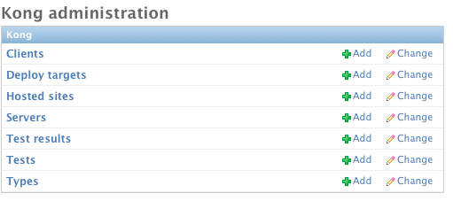

Overview
========

Getting Started
---------------

At work we have to manage a ton of Django based sites. Just for our World Company sites, we have over 50 different settings files, and this doesn't take into account the sites that we host for other clients. At this size it becomes basically impossible to test each site in a browser when you push things to production. To solve this problem I have written a very basic server description tool. This allows you to describe sites (settings file, python path, url, etc.) and servers.

